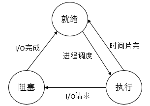

## 学习的内容

An Operating System is system software（系统软件） that manages computer hardware and software resources, and provides common services for computer programs.In this lesson we have to learn about the components of the operating system and how OS work.

These are the contents:

1. introduction of the OS
2. process management （进程管理）
3. processor scheduling（处理机调度）and deadlock（死锁）
4. memory management（存储器管理）
5. facility management（设备管理）
6. document management（文件管理）

## 学习的重点

1. introduction of the OS
   OS has four essential attributes.These are concurrent（并发）,shared（共享）,Virtualization（虚拟）and asynchronous（异步）.Concurrent is the most basic feature of the four.

   ### Concurrent
   Metioned to concurrent.There is a simliar feature named parallelism.Translate to Chinese,There is only a one-word difference.Parallelism is when two or more events occur at the same moment in time.Concurrent is when two or more events occur at the same time interval.

   ### Shared
   Shared means that resources in the OS are avaliable for common use by multiple concurrently executing process(threads)（进程或线程） in memory

   ### Virtualization
   Virtualization is the transformation of a physical entity into a number of logical counterparts through some technology.

   ### Asynchronous
   Processes move forward at unpredictable speeds.This is Asynchoronous.

Evolution of the operating system:

    single pass batch system (computing) - 单道批处理系统
    multichannel batch system - 多道批处理系统
    time-sharing system - 分时系统

2. process management （进程管理）
    
    If there is no OS,The program is executed sequentially（程序顺序执行）like input-compute-output.That's why it's slow.

    After OS,Multiple programs can be executed concurrently, and concurrent execution improves CPU efficiency and system throughput（系统吞吐量）.

    ### The states of process

    
    
    There are multiple states of them when programs are executed in OS.The most basic three are Ready, Blocking, Execute.

    Some of them are interchangeable.

    ### Threads

    Threads are called light processes or process elements, and in operating systems where threads are introduced, a process often has multiple threads, at least one of them.

    Threads can share resources in process.And their communication and exchange of resources is more plentiful.

    ### The algorithm of process management

    1. First-Come First-Served
    2. Shortest Job First
    3. Shortest Remaining Time Next
    4. Highest Response Rate First
    5. Round-Robin
    6. Highest Priority First
    7. Multilevel Feedback Queue Scheduling

3. processor scheduling（处理机调度）and deadlock（死锁）

    ### The algorithm of processor scheduling

    1. 先来先服务（FCFS）

        The first to come first to execute.It is very easy to understand

    2. 短作业优先（SJF）

        SJF will run a algorithm to consider the shortest assignment and execute it. 

    3. 优先级调度算法（PSA）
        
        优先权 = （等待时间 + 要求服务时间）/ 要求服务时间 = 响应时间 / 要求服务时间。

        Priority = (Wait Time + Requested Service Time) / Requested Service Time = Response Time / Requested Service Time.

    5. 时间片轮转法和多级反馈队列调度算法

        Introduce simply...

    ### Deadlock

    #### Requirements for generating a deadlock：

    Mutually Exclusive Condition（互斥条件）

    Request and Hold Condition（请求和保持）

    Non-Deprivation Condition（不剥夺）

    Loop Waiting Condition（环路等待）

    #### Basic approach to handling deadlocks：

    Preventing Deadlocks（预防死锁）

    Avoiding Deadlocks（避免死锁）

    Detecting Deadlocks（检测死锁）

    Unlocking Deadlocks（解除死锁）

    #### Banker's Algorithm（银行家算法）

    可利用资源向量Available[j] = k，最大需求矩阵Max[i,j] = k，分配矩阵Allocation[i,j] = k，需求矩阵Need[i,j] = k

    Need[i, j] = Max[i, j] - Allocation[i, j]

    ① 如果Requesti[j] <= Need[i, j]，转向②，否则，因为它所需要的资源数已超过它所宣布的最大值，出错。

    ② 如果Requesti[j] <= Available[j]，转向③，否则，表示尚无足够资源，Pi需要等待。

    ③ 系统尝试把资源分配给进程Pi，并修改数据结构中的数值：

    　　Available[j] = Available[j] - Requesti[j];

    　　Allocation[i, j] = Allocation[i, j] + Requesti[j];

    　　Need[i, j] = Need[i, j] - Requesti[j];

    ④ 系统执行安全性算法，检查此次资源分配后系统是否处于安全状态，若安全，才正式将资源分配给进程Pi，以完成本次分配，否则，将本次的尝试分配作废，恢复原来的资源分配状态，让进程Pi等待。

4. memory management（存储器管理）
   
   #### Memory hierarchy

   main memory（主存）

   registers（寄存器）

   Cache（高速缓存）

   Disk Cache（磁盘缓存）

   #### Continuous mode of distribution（连续分配方式）
   
   single continuous distribution

   Fixed partition allocation

   #### Dynamic Partition Allocation（动态分区分配）

    1. 首次适应算法（First Fit）
    2. 循环首次适应算法（Next Fit）
    3. 首次适应算法（First Fit）
    4. 快速适应算法（Quick Fit）

    #### Basic paging storage management（基本分页存储管理方式）

    The basic paged storage management approach is a memory management technique used by operating systems that divides physical memory into fixed-size pages (typically 4KB or larger in size) and divides the virtual address space of a process into page frames of the same size

    基本的分页存储管理方式是一种操作系统使用的内存管理技术，它将物理内存分割成固定大小的页面（通常大小为4KB或更大），并将进程的虚拟地址空间分割成相同大小的页框

    #### Basic segmented storage management（基本分段存储管理方式）

    Basic segmented storage management is a memory management technique used by operating systems that divides a process's address space into logical segments, each of which can contain different types of data or code

    基本的分段存储管理方式是一种操作系统使用的内存管理技术，它将进程的地址空间分为多个逻辑段，每个段可以包含不同类型的数据或代码

    #### Segmented page storage management approach（段页式存储管理方式）

    The Basic Segmented Pageed Memory Management approach is a combination of segmented and paged memory management designed to overcome their respective limitations in order to provide more flexible and efficient memory management

    基本段页式存储管理方式是一种将段式内存管理和分页式内存管理结合起来的方法，旨在克服它们各自的局限性，以提供更灵活和高效的内存管理

5. facility management（设备管理）

    Mainly about Management of disk storage.

    1. 先来先服务（FCFS, First Come First Service）
    2. 最短寻道时间优先（SSTF，Shortest Seek Time First）要求访问的磁道与当前磁头所在的磁道距离最近，以使每次的寻道时间最短。但这种算法不能保证平均寻道时间最短。
    3.  扫描（SCAN）算法:不仅考虑到欲访问的磁盘与当前磁道之间的距离，更优先考虑的是磁头当前的移动方向
    4.  循环扫描（CSCAN）算法:将最小的磁道号紧接着最大的磁道号构成循环，进行循环扫描。

6. document management（文件管理）

    Simply introdcution about the files

