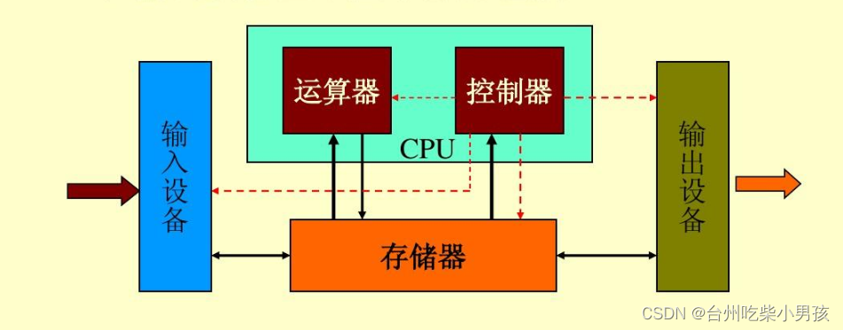

<!--
 * @Author: eraDong 115410761+eraDong@users.noreply.github.com
 * @Date: 2024-02-18 18:56:47
 * @LastEditors: eraDong 115410761+eraDong@users.noreply.github.com
 * @LastEditTime: 2024-02-18 19:25:38
 * @FilePath: \SUST\RandomThings\Postgraduation\APS\计算机组成原理与系统结构（empty）\taking.md
 * @Description: 这是默认设置,请设置`customMade`, 打开koroFileHeader查看配置 进行设置: https://github.com/OBKoro1/koro1FileHeader/wiki/%E9%85%8D%E7%BD%AE
-->
# What is Computer Organizetion and Architecture

计算机组成与原理是学习计算机系统的内部工作，结构化以及实现。
Computer Organization and Architecture is the study of internal working, structuring, and implementation of a computer system.

从几十年前的冯诺依曼结构开始学起,然后以后的课老师讲解各个部分的详细结构。
we learn from the very beginning,the von neumann architecture.For the rest classes,teacher would give a detailed explanation of those parts of the computer system.

## What do I learn

1. 存储系统 storage system

    main memory,auxiliary memory and cache.There is a rank of these memories.the more expansive and faster one rank the top.And they designed a system that mix these different memories together well which we can take the advantages of all of them like cheaper,faster,larger.

    The main memory is often used to connect the data and CPU.The auxiliary memory is used to store the data which is not frequently used.And cache can be used to speed up the data transfer between CPU and main memory.

2. 中央处理器 CPU

    CPU have now became the main part of the computer system.Before that,the von neumann claimed that the calculator is the main part.CPU have a lot of cores that can be used to deal with the data.The CPU can execute the instructions and transfer the data to/from the main memory and auxiliary memory.It is just like the humain brain.

3. I/O system

    I/O system is that we can use it to interact with the computer system more conviently.Like the keyboard we used is the input system.We can type the word and it will send instruction to the CPU and then it will display on the screen which is the output system.

